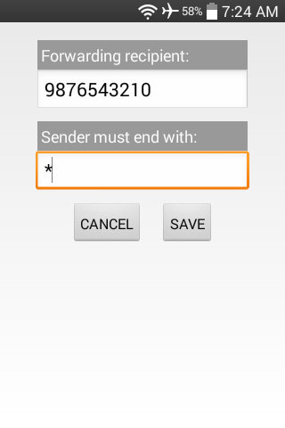
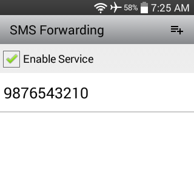

### [SMS Forwarding](https://github.com/warren-bank/Android-SMS-Automatic-Forwarding)

Android app that listens for incoming SMS text messages and conditionally forwards them to other numbers.

#### Notes:

* minimum supported version of Android:
  - Android 3.0 (API level 11)

#### Screenshots:

- - - -

### Configuration

#### Forwarding Rules:

* `Enable Service` checkbox:
  - used to enable/disable this service
* `ADD` ActionBar menu item:
  - adds new forwarding rule
* forwarding rule entries are defined as follows:
  - `Forwarding recipient`:
    * a valid phone number (without any punctuation)
  - `Sender must end with`:
    * this value specifies a phone number (without any punctuation)
      - a match occurs when the _sender_ of an incoming SMS message ends with this exact value
      - a special match-all glob pattern `*` is supported, which can either be manually entered into the field or automatically set when the field is left empty
    * this value acts as a filter
      - `Forwarding recipient` will only receive copies of incoming SMS messages that match this value
* forwarding rule entries can be modified
  - clicking on an existing recipient opens a dialog with options to:
    * edit field values, and save changes
    * delete

- - - -

#### Build Flavors:

* `english`
  - includes string resources for only the English language
* `withAllLanguageTranslations`
  - includes string resources for 51 additional languages
* `noContactName`
  - "Forwarded from: &lt;sender_phone&gt;"
* `withContactName`
  - "Forwarded from: &lt;sender_name&gt; &lt;sender_phone&gt;"
    * if `sender_phone` is found in the local contacts list, and the contact has a name associated with it
  - "Forwarded from: &lt;sender_phone&gt;"
    * otherwise

- - - -

#### Caveats:

* _Google Voice_:
  - when an SMS is sent from a _Google Voice_ number to the SIM card number
    * everything works as expected
  - when an SMS is sent to a _Google Voice_ number
    * the sender of the SMS message will always be a number belonging to the _Google Voice_ backend infrastructure
    * keep this in mind when setting forwarding filters

#### Legal:

* copyright: [Warren Bank](https://github.com/warren-bank)
* license: [GPL-2.0](https://www.gnu.org/licenses/old-licenses/gpl-2.0.txt)
